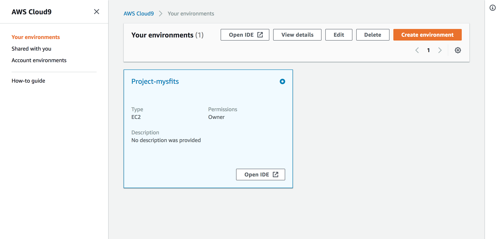
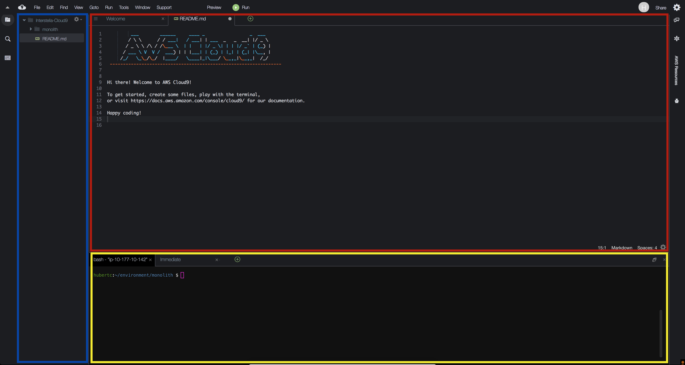
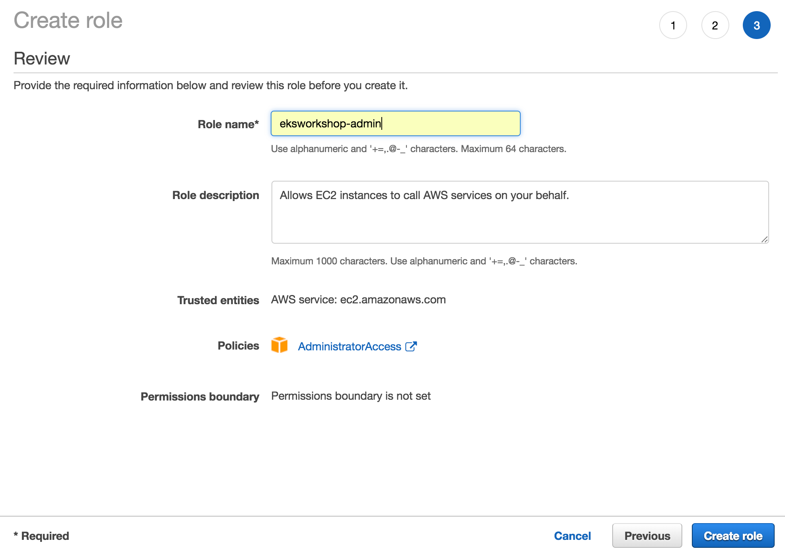
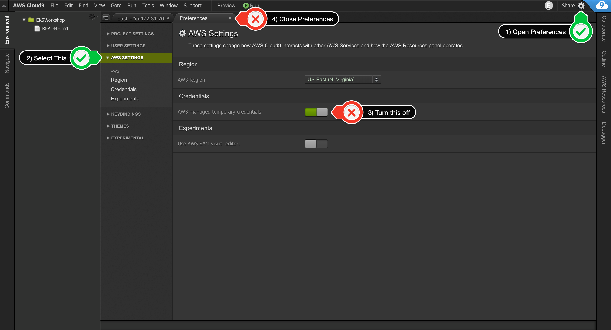
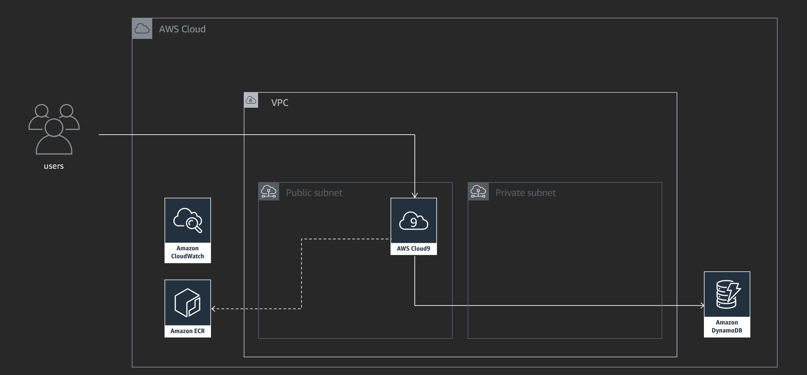
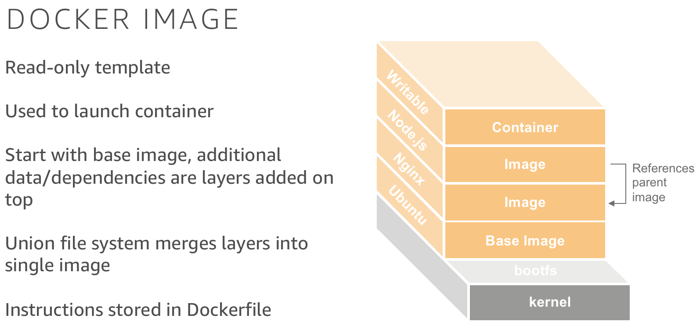
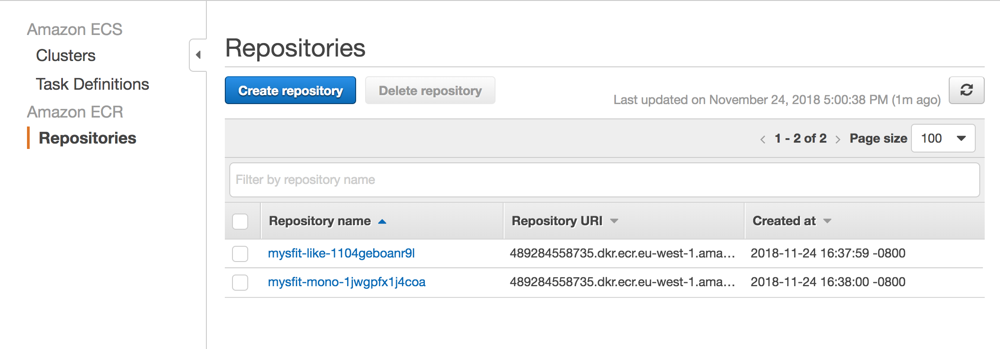
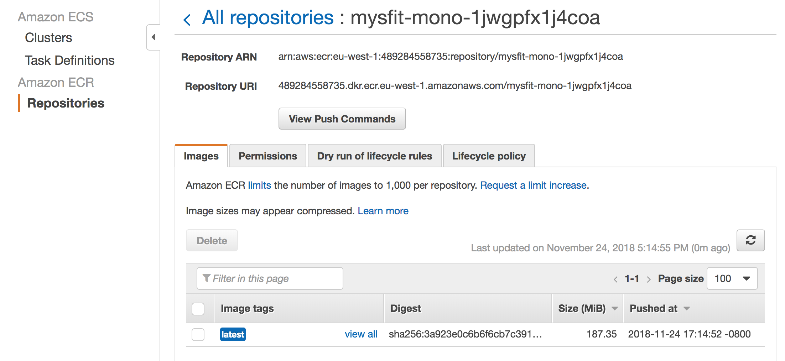

Monolith to Microservices with Docker and Amazon EKS
====================================================

Welcome to the Mythical Mysfits team!

In this lab, you'll build the monolithic Mythical Mysfits adoption platform with Docker, deploy it on Amazon EKS, and then break it down into a couple of more manageable microservices. Let's get started!

### Requirements:

* AWS account - if you don't have one, it's easy and free to [create one](https://aws.amazon.com/).
* AWS IAM account with elevated privileges allowing you to interact with CloudFormation, IAM, EC2, EKS, ECR, ELB/ALB, VPC, SNS, CloudWatch, DynamoDB, Cloud9. [Learn how](https://docs.aws.amazon.com/IAM/latest/UserGuide/id_users_create.html).
* Familiarity with [Python](https://wiki.python.org/moin/BeginnersGuide/Programmers), [Docker](https://www.docker.com/), and [AWS](httpts://aws.amazon.com) - *not required but a bonus*.

### What you'll do:

These labs are designed to be completed in sequence, and the full set of instructions are documented below.  Read and follow along to complete the labs.  If you're at a live AWS event, the workshop staff will give you a high-level overview of the labs and help answer any questions.  Don't worry if you get stuck, we provide hints along the way.


* **Workshop Setup:** [Setup working environment on AWS](#lets-begin)
* **Lab 0:** [Launch your EKS Cluster](#lab-0---launch-your-eks-cluster)
* **Lab 1:** [Containerize the Mythical Mysfits monolith](#lab-1---containerize-the-mythical-mysfits-adoption-agency-platform)
* **Lab 2:** [Deploy the container using EKS](Lab2.adoc)
* **Lab 3:** [Incrementally build and deploy more microservices with EKS and ALB Ingress](Lab3.md)
* **LAB 4:** [Configure CloudWatch Logs](Lab4/README.md)
* **[*OPTIONAL*] LAB 5:** [Configure a CI/CD pipeline](Lab5/README.md)
* **Cleanup** [Put everything away nicely](#workshop-cleanup)

### Conventions:

Throughout this workshop, we will provide commands for you to run in the terminal.  These commands will look like this:

<pre>
$ ssh -i <b><i>PRIVATE_KEY.PEM</i></b> ec2-user@<b><i>EC2_PUBLIC_DNS_NAME</i></b>
</pre>

The command starts after the `$`.  Text that is ***UPPER_ITALIC_BOLD*** indicates a value that is unique to your environment.  For example, ***PRIVATE\_KEY.PEM*** refers to the private key of an SSH key pair that you've created in your account, and ***EC2\_PUBLIC\_DNS\_NAME*** is a value that is specific to an EC2 instance launched in your account.  You can find these unique values either in the CloudFormation outputs or by navigating to the specific service dashboard in the [AWS management console](https://console.aws.amazon.com).

Hints are also provided along the way and will look like this:

<details>
<summary>HINT</summary>

**Nice work, you just revealed a hint!**
</details>


*Click on the arrow to show the contents of the hint.*

### IMPORTANT: Workshop Cleanup

You will be deploying infrastructure on AWS which will have an associated cost. If you're attending an AWS event, credits will be provided.  When you're done with the workshop, [follow the steps at the very end of the instructions](#workshop-cleanup) to make sure everything is cleaned up and avoid unnecessary charges.


## Let's Begin!

### Workshop Setup:

1. Open the CloudFormation launch template link below in a new tab. The link will load the CloudFormation Dashboard and start the stack creation process in the chosen region:
   
    Click on one of the **Deploy to AWS** icons below to region to stand up the core workshop infrastructure.

| Region | Launch Template |
| ------------ | ------------- | 
**Oregon** (us-west-2) | [](https://console.aws.amazon.com/cloudformation/home?region=us-west-2#/stacks/new?stackName=mythical-mysfits-eks&templateURL=https://s3-us-west-2.amazonaws.com/syd-eksworkshop-2019/modifiedcore.yml)  


2. The template will automatically bring you to the CloudFormation Dashboard and start the stack creation process in the specified region. Give the stack a name that is unique within your account, and proceed through the wizard to launch the stack. Leave all options at their default values, but make sure to check the box to allow CloudFormation to create IAM roles on your behalf (you may not see this if there's no new IAM role being created):

    

    See the *Events* tab for progress on the stack launch. You can also see details of any problems here if the launch fails. Proceed to the next step once the stack status advances to "CREATE_COMPLETE".

3. Access the AWS Cloud9 Environment created by CloudFormation:

    On the AWS Console home page, type **Cloud9** into the service search bar and select it. Find the environment named like "Project-***STACK_NAME***":

    

    When you open the IDE, you'll be presented with a welcome screen that looks like this:
    

    On the left pane (Blue), any files downloaded to your environment will appear here in the file tree. In the middle (Red) pane, any documents you open will show up here. Test this out by double clicking on README.md in the left pane and edit the file by adding some arbitrary text. Then save it by clicking File and Save. Keyboard shortcuts will work as well. On the bottom, you will see a bash shell (Yellow). For the remainder of the lab, use this shell to enter all commands. You can also customize your Cloud9 environment by changing themes, moving panes around, etc. (if you like the dark theme, you can select it by clicking the gear icon in the upper right, then "Themes", and choosing the dark theme).

4. Clone the Mythical Mysfits Workshop EKS Repository:

    In the bottom panel of your new Cloud9 IDE, you will see a terminal command line terminal open and ready to use.  Run the following git command in the terminal to clone the necessary code to complete this tutorial:

    ```
    $ git clone https://github.com/kmhabib/sydummit-eksworkshop-2019.git
    ```

    After cloning the repository, you'll see that your project explorer now includes the files cloned.

    In the terminal, change directory to the subdirectory for this workshop in the repo:

    ```
    $ cd sydummit-eksworkshop-2019.git/workshop-1
    ```

5. Run some additional automated setup steps with the `setup` script:

    ```
    $ script/setup
    $ script/EKSPreReqs.sh
    if the EKSPreReqs.sh script gives error, issue this command:
    $ chmod +x script/EKSPreReqs.sh 
    ```

    This first script will delete some unneeded Docker images to free up disk space, populate a DynamoDB table with some seed data, upload site assets to S3, and install some Docker-related authentication mechanisms that will be discussed later. Make sure you see the "Success!" message when the script completes. The second script will install **kubectl**, **aws-iam-authenticator**, **eksctl** and **kubectx**

6. EKS related setup 
---
### Create an IAM role for your Workspace
---
1. Follow [this deep link to create an IAM role with Administrator access.](https://console.aws.amazon.com/iam/home#/roles$new?step=review&commonUseCase=EC2%2BEC2&selectedUseCase=EC2&policies=arn:aws:iam::aws:policy%2FAdministratorAccess)
2. Confirm that **AWS service** and **EC2** are selected, then click **Next** to view permissions.
3. Confirm that **AdministratorAccess** is checked, then click **Next** to review.
4. Enter **eksworkshop-admin** for the Name, and select **Create Role**


---
### Attach the IAM role to your Workspace
---

1. Follow [this deep link to find your Cloud9 EC2 instance](https://console.aws.amazon.com/ec2/v2/home?#Instances:tag:Name=aws-cloud9-Project-mythical-mysfits-eks-*;sort=desc:launchTime)
2. Select the instance, then choose **Actions / Instance Settings / Attach/Replace IAM Role**

3. Choose **eksworkshop-admin** from the **IAM Role** drop down, and select **Apply**


---
### Update IAM settings for your Workspace
---

<details>
<summary>HINT</summary>

**Cloud9 normally manages IAM credentials dynamically. This isn't currently compatible with
the aws-iam-authenticator plugin, so we will disable it and rely on the IAM role instead.**

</details>


- Return to your workspace and click the sprocket, or launch a new tab to open the Preferences tab
- Select **AWS SETTINGS**
- Turn off **AWS managed temporary credentials**
- Close the Preferences tab


- To ensure temporary credentials aren't already in place we will also remove
any existing credentials file:
```
rm -vf ${HOME}/.aws/credentials
```

- We should configure our aws cli with our current region as default. Ensure that the region you get is **us-west-2**:
```
export AWS_REGION=$(curl -s 169.254.169.254/latest/dynamic/instance-identity/document | jq -r '.region')
echo "export AWS_REGION=${AWS_REGION}" >> ~/.bash_profile
aws configure set default.region ${AWS_REGION}
aws configure get default.region
```
### Validate the IAM role

Use the [GetCallerIdentity](https://docs.aws.amazon.com/cli/latest/reference/sts/get-caller-identity.html) CLI command to validate that the Cloud9 IDE is using the correct IAM role.

First, get the IAM role name from the AWS CLI.
```
INSTANCE_PROFILE_NAME=`basename $(aws ec2 describe-instances --filters Name=tag:Name,Values=aws-cloud9-${C9_PROJECT}-${C9_PID} | jq -r '.Reservations[0].Instances[0].IamInstanceProfile.Arn' | awk -F "/" "{print $2}")`
aws iam get-instance-profile --instance-profile-name $INSTANCE_PROFILE_NAME --query "InstanceProfile.Roles[0].RoleName" --output text
```

The output is the role name.

```sh
eksworkshop-admin
```

Compare that with the result of

```sh
aws sts get-caller-identity
```

#### VALID

If the _Arn_ contains the role name from above and an Instance ID, you may proceed.

```
{
    "Account": "123456789012",
    "UserId": "AROA1SAMPLEAWSIAMROLE:i-01234567890abcdef",
    "Arn": "arn:aws:sts::123456789012:assumed-role/eksworkshop-admin/i-01234567890abcdef"
}
or
{
    "Account": "123456789012",
    "UserId": "AROA1SAMPLEAWSIAMROLE:i-01234567890abcdef",
    "Arn": "arn:aws:sts::123456789012:assumed-role/modernizer-workshop-cl9/i-01234567890abcdef"
}
```

#### INVALID

If the *Arn* contains `TeamRole`, `MasterRole`, or does not match the role name, **DO NOT PROCEED**. Go back and confirm the steps on this page.

```
{
    "Account": "123456789012",
    "UserId": "AROA1SAMPLEAWSIAMROLE:i-01234567890abcdef",
    "Arn": "arn:aws:sts::123456789012:assumed-role/TeamRole/MasterRole"
}
```

### Checkpoint:
At this point, the Mythical Mysfits website should be available at the static site endpoint for the S3 bucket created by CloudFormation. You can visit the site at <code>http://<b><i>BUCKET_NAME</i></b>.s3-website.us-west-2.amazonaws.com/</code>. You can find the ***BUCKET_NAME*** in the CloudFormation outputs saved in the file `workshop-1/cfn-outputs.json`. Or you can issue the command `aws s3 ls` and get the name of the S3 bucket. Check that you can view the site, but there won't be much content visible yet until we launch the Mythical Mysfits monolith service:


[*^ back to top*](#lets-begin)


## Lab 0 - Launch your EKS Cluster

---
### Create an SSH key
---


Please run this command to generate SSH Key in Cloud9. This key will be used on the worker node instances to allow ssh access if necessary.

```sh
bash
ssh-keygen
```


> Press `enter` 3 times to take the default choices


Upload the public key to your EC2 region:

```bash
aws ec2 import-key-pair --key-name "eksworkshop" --public-key-material file://~/.ssh/id_rsa.pub
```

---
### Now Launch an EKS Cluster
---
You'll use EKSCTL to launch your EKS cluster. To learn more about EKSCTL, [click here](https://youtu.be/3-OZqA5p1HA). **Make sure you keep the name of the cluster `mythicalmysfits` since future labs will rely on this**
```sh
eksctl create cluster --full-ecr-access --name=mythicalmysfits
```

You can expect to see an output like the one below.
```
eksctl create cluster --full-ecr-access --name=mythicalmysfits
2018-08-27T21:36:50Z [ℹ]  setting availability zones to [us-west-2c us-west-2b us-west-2a]
2018-08-27T21:36:50Z [ℹ]  importing SSH public key "/home/ec2-user/.ssh/eks-key.pub" as "eksctl-mythicalmysfits-20:bc:c5:14:ab:c1:6b:92:10:e5:92:c0:2a:9e:07:37"
2018-08-27T21:36:50Z [ℹ]  creating EKS cluster "mythicalmysfits" in "us-west-2" region
2018-08-27T21:36:50Z [ℹ]  creating VPC stack "EKS-mythicalmysfits-VPC"
2018-08-27T21:36:50Z [ℹ]  creating ServiceRole stack "EKS-mythicalmysfits-ServiceRole"
2018-08-27T21:37:31Z [✔]  created ServiceRole stack "EKS-mythicalmysfits-ServiceRole"
2018-08-27T21:37:51Z [✔]  created VPC stack "EKS-mythicalmysfits-VPC"
2018-08-27T21:37:51Z [ℹ]  creating control plane "mythicalmysfits"
....
```

> **Take note of your cluster name and record it.** 

> **Cluster can take from 10-20 minutes. Go start Lab 1 where you're going to dockerize the image in a new Cloud9 Terminal shell and come back and verify successful creation of cluster once you're done there**. 


> by default, 3 namespaces have been created
```
$ kubectl get namespaces
NAME          STATUS    AGE
default       Active    12m
kube-public   Active    12m
kube-system   Active    12m
```
verify 2 x Nodes have been created. These are your 2 EC2 instances that have been spun up by EKSCTL. You can verify this on the console
```
kubectl get nodes 

$ kubectl get nodes 
NAME                                           STATUS    ROLES     AGE       VERSION
ip-192-168-6-81.us-west-2.compute.internal     Ready     <none>    6m        v1.11.9
ip-192-168-72-167.us-west-2.compute.internal   Ready     <none>    6m        v1.11.9
```
**Optional**

<details>
<summary>Installing Kubernetes Dashboard</summary>

If you want to install the Kubernetes DASHBOARD:

```
kubectl create -f https://raw.githubusercontent.com/kubernetes/dashboard/master/src/deploy/recommended/kubernetes-dashboard.yaml

kubectl proxy &
```

Browse to: http://localhost:8080/api/v1/namespaces/kube-system/services/https:kubernetes-dashboard:/proxy/

and enter the token generated from this output. Note: Make sure you've provided the right clustername.
```
aws-iam-authenticator token -i mythicalmysfits --token-only
```
</details>


## Lab 1 - Containerize the Mythical Mysfits adoption agency platform

The Mythical Mysfits adoption agency infrastructure has always been running directly on EC2 VMs. Our first step will be to modernize how our code is packaged by containerizing the current Mythical Mysfits adoption platform, which we'll also refer to as the monolith application.  To do this, you will create a [Dockerfile](https://docs.docker.com/engine/reference/builder/), which is essentially a recipe for [Docker](https://aws.amazon.com/docker) to build a container image.  You'll use your [AWS Cloud9](https://aws.amazon.com/cloud9/) development environment to author the Dockerfile, build the container image, and run it to confirm it's able to process adoptions.

[Containers](https://aws.amazon.com/what-are-containers/) are a way to package software (e.g. web server, proxy, batch process worker) so that you can run your code and all of its dependencies in a resource isolated process. You might be thinking, "Wait, isn't that a virtual machine (VM)?" Containers virtualize the operating system, while VMs virtualize the hardware. Containers provide isolation, portability and repeatability, so your developers can easily spin up an environment and start building without the heavy lifting.  More importantly, containers ensure your code runs in the same way anywhere, so if it works on your laptop, it will also work in production.

### Here's what you're going to work on in lab 1:



1. Review the draft Dockerfile and add the missing instructions indicated by comments in the file:

    *Note: If you're already familiar with how Dockerfiles work and want to focus on breaking the monolith apart into microservices, skip down to ["HINT: Final Dockerfile"](#final-dockerfile) near the end of step 5, create a Dockerfile in the monolith directory with the hint contents, build the "monolith" image, and continue to step 6.  Otherwise continue on...*

    One of the Mythical Mysfits' developers started working on a Dockerfile in her free time, but she was pulled to a high priority project before she finished.

    In the Cloud9 file tree, navigate to `workshop-1/app/monolith-service`, and double-click on **Dockerfile.draft** to open the file for editing.

    *Note: If you would prefer to use the bash shell and a text editor like vi or emacs instead, you're welcome to do so.*

    Review the contents, and you'll see a few comments at the end of the file noting what still needs to be done.  Comments are denoted by a "#".

    Docker builds container images by stepping through the instructions listed in the Dockerfile.  Docker is built on this idea of layers starting with a base and executing each instruction that introduces change as a new layer.  It caches each layer, so as you develop and rebuild the image, Docker will reuse layers (often referred to as intermediate layers) from cache if no modifications were made.  Once it reaches the layer where edits are introduced, it will build a new intermediate layer and associate it with this particular build.  This makes tasks like image rebuild very efficient, and you can easily maintain multiple build versions.

    

    For example, in the draft file, the first line - `FROM ubuntu:latest` - specifies a base image as a starting point.  The next instruction - `RUN apt-get -y update` - creates a new layer where Docker updates package lists from the Ubuntu repositories.  This continues until you reach the last instruction which in most cases is an `ENTRYPOINT` *(hint hint)* or executable being run.

    Add the remaining instructions to Dockerfile.draft.

    <details>
    <summary>HINT: Helpful links for completing Dockefile.draft</summary>
    <pre>
    Here are links to external documentation to give you some ideas:

    #[TODO]: Copy the "service" directory into container image

    - Consider the [COPY](https://docs.docker.com/engine/reference/builder/#copy) command
    - You're copying both the python source files and requirements.txt from the "monolith-service/service" directory on your EC2 instance into the working directory of the container, which can be specified as "."

    #[TODO]: Install dependencies listed in the requirements.txt file using pip

    - Consider the [RUN](https://docs.docker.com/engine/reference/builder/#run) command
    - More on [pip and requirements files](https://pip.pypa.io/en/stable/user_guide/#requirements-files)
    - We're using pip and python binaries from virtualenv, so use "bin/pip" for your command

    #[TODO]: Specify a listening port for the container

    - Consider the [EXPOSE](https://docs.docker.com/engine/reference/builder/#expose) command
    - App listening portNum can be found in the app source - mythicalMysfitsService.py

    #[TODO]: Run "mythicalMysfitsService.py" as the final step. We want this container to run as an executable. Looking at ENTRYPOINT for this?

    - Consider the [ENTRYPOINT](https://docs.docker.com/engine/reference/builder/#entrypoint) command
    - Our ops team typically runs 'python mythicalMysfitsService.py' to launch the application on our servers.
    </pre>
    </details>

    Once you're happy with your additions OR if you get stuck, you can check your work by comparing your work with the hint below.

    <details>
    <summary>HINT: Completed Dockerfile</summary>
    <pre>
    FROM ubuntu:latest
    RUN apt-get update -y
    RUN apt-get install -y python-pip python-dev build-essential
    RUN pip install --upgrade pip
    COPY ./service /MythicalMysfitsService
    WORKDIR /MythicalMysfitsService
    RUN pip install -r ./requirements.txt
    EXPOSE 80
    ENTRYPOINT ["python"]
    CMD ["mythicalMysfitsService.py"]
    </pre>
    </details>

    If your Dockerfile looks good, rename your file from "Dockerfile.draft" to "Dockerfile" and continue to the next step.

    <pre>
    $ mv Dockerfile.draft Dockerfile
    </pre>

2. Build the image using the [Docker build](https://docs.docker.com/engine/reference/commandline/build/) command.

    This command needs to be run in the same directory where your Dockerfile is. **Note the trailing period** which tells the build command to look in the current directory for the Dockerfile.

    <pre>
    $ docker build -t monolith-service .
    </pre>

    You'll see a bunch of output as Docker builds all layers of the image.  If there is a problem along the way, the build process will fail and stop (red text and warnings along the way are fine as long as the build process does not fail).  Otherwise, you'll see a success message at the end of the build output like this:

    <pre>
    Step 9/10 : ENTRYPOINT ["python"]
     ---> Running in 7abf5edefb36
    Removing intermediate container 7abf5edefb36
     ---> 653ccee71620
    Step 10/10 : CMD ["mythicalMysfitsService.py"]
     ---> Running in 291edf3d5a6f
    Removing intermediate container 291edf3d5a6f
     ---> a8d2aabc6a7b
    Successfully built a8d2aabc6a7b
    Successfully tagged monolith-service:latest
    </pre>

    *Note: Your output will not be exactly like this, but it will be similar.*

    Awesome, your Dockerfile built successfully, but our developer didn't optimize the Dockefile for the microservices effort later.  Since you'll be breaking apart the monolith codebase into microservices, you will be editing the source code (e.g. `mythicalMysfitsService.py`) often and rebuilding this image a few times.  Looking at your existing Dockerfile, what is one thing you can do to improve build times?

    <details>
    <summary>HINT</summary>
    Remember that Docker tries to be efficient by caching layers that have not changed.  Once change is introduced, Docker will rebuild that layer and all layers after it.

    Edit mythicalMysfitsService.py by adding an arbitrary comment somewhere in the file.  If you're not familiar with Python, [comments](https://docs.python.org/2/tutorial/introduction.html) start with the hash character, '#' and are essentially ignored when the code is interpreted.

    For example, here a comment (`# Author: Mr Bean`) was added before importing the time module:
    <pre>
    # Author: Mr Bean

    import time
    from flask import Flask
    from flask import request
    import json
    import requests
    ....
    </pre>

    Rebuild the image using the 'docker build' command from above and notice Docker references layers from cache, and starts rebuilding layers starting from Step 5, when mythicalMysfitsService.py is copied over since that is where change is first introduced:

    <pre>
    Step 5/10 : COPY ./service /MythicalMysfitsService
     ---> 9ec17281c6f9
    Step 6/10 : WORKDIR /MythicalMysfitsService
     ---> Running in 585701ed4a39
    Removing intermediate container 585701ed4a39
     ---> f24fe4e69d88
    Step 7/10 : RUN pip install -r ./requirements.txt
     ---> Running in 1c878073d631
    Collecting Flask==0.12.2 (from -r ./requirements.txt (line 1))
    </pre>

    Try reordering the instructions in your Dockerfile to copy the monolith code over after the requirements are installed.  The thinking here is that the Python source will see more changes than the dependencies noted in requirements.txt, so why rebuild requirements every time when we can just have it be another cached layer.
    </details>

    Edit your Dockerfile with what you think will improve build times and compare it with the Final Dockerfile hint below.


    #### Final Dockerfile
    <details>
    <summary>HINT: Final Dockerfile</summary>
    <pre>
    FROM ubuntu:latest
    RUN apt-get update -y
    RUN apt-get install -y python-pip python-dev build-essential
    RUN pip install --upgrade pip
    COPY service/requirements.txt .
    RUN pip install -r ./requirements.txt
    COPY ./service /MythicalMysfitsService
    WORKDIR /MythicalMysfitsService
    EXPOSE 80
    ENTRYPOINT ["python"]
    CMD ["mythicalMysfitsService.py"]
    </pre>
    </details>

    To see the benefit of your optimizations, you'll need to first rebuild the monolith image using your new Dockerfile (use the same build command at the beginning of step 2 `docker build -t monolith-service .`.  Then, introduce a change in `mythicalMysfitsService.py` (e.g. add another arbitrary comment) and rebuild the monolith image again.  Docker cached the requirements during the first rebuild after the re-ordering and references cache during this second rebuild.  You should see something similar to below:

    <pre>
    Step 6/11 : RUN pip install -r ./requirements.txt
     ---> Using cache
     ---> 612509a7a675
    Step 7/11 : COPY ./service /MythicalMysfitsService
     ---> c44c0cf7e04f
    Step 8/11 : WORKDIR /MythicalMysfitsService
     ---> Running in 8f634cb16820
    Removing intermediate container 8f634cb16820
     ---> 31541db77ed1
    Step 9/11 : EXPOSE 80
     ---> Running in 02a15348cd83
    Removing intermediate container 02a15348cd83
     ---> 6fd52da27f84
    </pre>

    You now have a Docker image built.  The -t flag names the resulting container image.  List your docker images and you'll see the "monolith-service" image in the list. Here's a sample output, note the monolith image in the list:

    <pre>
    $ docker images
    REPOSITORY                                                              TAG                 IMAGE ID            CREATED              SIZE
    monolith-service                                                        latest              29f339b7d63f        About a minute ago   506MB
    ubuntu                                                                  latest              ea4c82dcd15a        4 weeks ago          85.8MB
    golang                                                                  1.9                 ef89ef5c42a9        4 months ago         750MB
    </pre>

    *Note: Your output will not be exactly like this, but it will be similar.*

    Notice the image is also tagged as "latest".  This is the default behavior if you do not specify a tag of your own, but you can use this as a freeform way to identify an image, e.g. monolith-service:1.2 or monolith-service:experimental.  This is very convenient for identifying your images and correlating an image with a branch/version of code as well.

3. Run the docker container and test the adoption agency platform running as a container:

    Use the [docker run](https://docs.docker.com/engine/reference/run/) command to run your image; the -p flag is used to map the host listening port to the container listening port.
    You can get the name of the DDB_TABLE_NAME by issuing the following command (output on my ide is below):

    ```sh
    $ aws dynamodb list-tables
    {
        "TableNames": [
            "Table-mythical-mysfits-eks"
        ]
    }
    ```

    ```sh
    $ docker run -p 8000:80 -e AWS_DEFAULT_REGION=us-west-2 -e DDB_TABLE_NAME=<YOUR_TABLE_NAME> monolith-service
    ```

    *Note: You can also find your DynamoDB table name in the file `workshop-1/cfn-output.json` derived from the outputs of the CloudFormation stack or from the aws cli command given above.*

    Here's sample output as the application starts:

    ```
    * Running on http://0.0.0.0:80/ (Press CTRL+C to quit)
    ```

    *Note: Your output will not be exactly like this, but it will be similar.*

    To test the basic functionality of the monolith service, query the service using a utility like [cURL](https://curl.haxx.se/), which is bundled with Cloud9.

    Click on the plus sign next to your tabs and choose **New Terminal** or click **Window** -> **New Terminal** from the Cloud9 menu to open a new shell session to run the following curl command.

    <pre>
    $ curl http://localhost:8000/mysfits
    </pre>

    You should see a JSON array with data about a number of Mythical Mysfits.

    *Note: Processes running inside of the Docker container are able to authenticate with DynamoDB because they can access the EC2 metadata API endpoint running at `169.254.169.254` to retrieve credentials for the instance profile that was attached to our Cloud9 environment in the initial setup script. Processes in containers cannot access the `~/.aws/credentials` file in the host filesystem (unless it is explicitly mounted into the container).*

    Switch back to the original shell tab where you're running the monolith container to check the output from the monolith.

    The monolith container runs in the foreground with stdout/stderr printing to the screen, so when the request is received, you should see a `200`. "OK".

    Here is sample output:

    <pre>
    INFO:werkzeug:172.17.0.1 - - [16/Nov/2018 22:24:18] "GET /mysfits HTTP/1.1" 200 -
    </pre>

    In the tab you have the running container, type **Ctrl-C** to stop the running container.  Notice, the container ran in the foreground with stdout/stderr printing to the console.  In a production environment, you would run your containers in the background and configure some logging destination.  We'll worry about logging later, but you can try running the container in the background using the -d flag.

    ```sh
    $ docker run -d -p 8000:80 -e AWS_DEFAULT_REGION=us-west-2 -e DDB_TABLE_NAME=<YOUR_TABLE_NAME> monolith-service
    ```

    List running docker containers with the [docker ps](https://docs.docker.com/engine/reference/commandline/ps/) command to make sure the monolith is running.

    <pre>
    $ docker ps
    </pre>

    You should see monolith running in the list. Now repeat the same curl command as before, ensuring you see the same list of Mysfits. You can check the logs again by running [docker logs](https://docs.docker.com/engine/reference/commandline/ps/) (it takes a container name or id fragment as an argument).

    ```sh
    $ docker logs *CONTAINER_ID*
    ```

    Here's **sample** output from the above commands:

   <pre>
    $ docker run -d -p 8000:80 -e AWS_DEFAULT_REGION=<=us-west-2 -e DDB_TABLE_NAME=Table-mythical-mysfits-eks monolith-service
    51aba5103ab9df25c08c18e9cecf540592dcc67d3393ad192ebeda6e872f8e7a
    $ docker ps
    CONTAINER ID        IMAGE                           COMMAND                  CREATED             STATUS              PORTS                  NAMES
    51aba5103ab9        monolith-service:latest         "python mythicalMysf…"   24 seconds ago      Up 23 seconds       0.0.0.0:8000->80/tcp   awesome_varahamihira
    $ curl localhost:8000/mysfits
    {"mysfits": [...]}
    $ docker logs 51a
     * Running on http://0.0.0.0:80/ (Press CTRL+C to quit)
    172.17.0.1 - - [16/Nov/2018 22:56:03] "GET /mysfits HTTP/1.1" 200 -
    INFO:werkzeug:172.17.0.1 - - [16/Nov/2018 22:56:03] "GET /mysfits HTTP/1.1" 200 -
   </pre>

    In the sample output above, the container was assigned the name "awesome_varahamihira".  Names are arbitrarily assigned.  You can also pass the docker run command a name option if you want to specify the running name.  You can read more about it in the [Docker run reference](https://docs.docker.com/engine/reference/run/).  Kill the container using `docker kill` now that we know it's working properly.

4. Now that you have a working Docker image, tag and push the image to [Elastic Container Registry (ECR)](https://aws.amazon.com/ecr/).  ECR is a fully-managed Docker container registry that makes it easy to store, manage, and deploy Docker container images. In the next lab, we'll use EKS to pull your image from ECR.

    In the AWS Management Console, navigate to [Repositories](https://console.aws.amazon.com/ecs/home#/repositories) in the ECS dashboard.  You should see repositories for the monolith service and like service.  These were created by CloudFormation and named like <code><b><i>STACK_NAME</i></b>-mono-xxx</code> and <code><b><i>STACK_NAME</i></b>-like-xxx</code> where ***STACK_NAME*** is the name of the CloudFormation stack (the stack name may be truncated).

    

    Click on the repository name for the **mono**, and note down the Repository URI (you will use this value again in the next lab):

    

    *Note: Your repository URI will be unique.*

<details>
<summary>HINT</summary>
<pre>
You can also use the AWS CLI command to get the list of ECR Repos. Use the one which has monolith in the name:
aws ecr describe-repositories | jq '.repositories[0].repositoryUri'
aws ecr describe-repositories | jq '.repositories[1].repositoryUri'
</pre>
</details>

Tag and push your container image to the mono repository.

    
    $ docker tag monolith-service:latest <ECR_REPOSITORY_URI>:latest
    $ docker push <ECR_REPOSITORY_URI>:latest

When you issue the push command, Docker pushes the layers up to ECR.

Here's sample output from these commands:

<pre>
    $ docker tag monolith-service:latest 873896820536.dkr.ecr.us-east-2.amazonaws.com/mysfit-mono-oa55rnsdnaud:latest
    $ docker push 873896820536.dkr.ecr.us-east-2.amazonaws.com/mysfit-mono-oa55rnsdnaud:latest
    The push refers to a repository [873896820536.dkr.ecr.us-east-2.amazonaws.com/mysfit-mono-oa55rnsdnaud:latest]
    0f03d692d842: Pushed
    ddca409d6822: Pushed
    d779004749f3: Pushed
    4008f6d92478: Pushed
    e0c4f058a955: Pushed
    7e33b38be0e9: Pushed
    b9c7536f9dd8: Pushed
    43a02097083b: Pushed
    59e73cf39f38: Pushed
    31df331e1f23: Pushed
    630730f8c75d: Pushed
    827cd1db9e95: Pushed
    e6e107f1da2f: Pushed
    c41b9462ea4b: Pushed
    latest: digest: sha256:a27cb7c6ad7a62fccc3d56dfe037581d314bd8bd0d73a9a8106d979ac54b76ca size: 3252
</pre>

*Note: Typically, you'd have to log into your ECR repo. However, you did not need to authenticate docker with ECR because the [Amazon ECR Credential Helper](https://github.com/awslabs/amazon-ecr-credential-helper) has been installed and configured for you on the Cloud9 Environment.  This was done earlier when you ran the setup script. You can read more about the credentials helper in this [article](https://aws.amazon.com/blogs/compute/authenticating-amazon-ecr-repositories-for-docker-cli-with-credential-helper/).*

If you refresh the ECR repository page in the console, you'll see a new image uploaded and tagged as latest.



### Checkpoint:
At this point, you should have a working container for the monolith codebase stored in an ECR repository and ready to deploy with EKS in the next lab.


**Please now proceed to [*Lab 2*](Lab2.adoc) - Deploy your container using ECR/EKS**    
**or go [*^ back to the top*](#monolith-to-microservices-with-docker-and-amazon-eks)**


-----
## Workshop Cleanup

This is really important because if you leave stuff running in your account, it will continue to generate charges.  Certain things were created by CloudFormation and certain things were created manually throughout the workshop.  Follow the steps below to make sure you clean up properly.

Delete manually created resources throughout the labs:

1. Delete EKS service(s)

    * kubectl delete -f Kubernetes/likeservice-app.yaml
    * kubectl delete -f Kubernetes/nolikeservice-app.yaml
    * kubectl delete -f Kubernetes/mythical-ingress.yaml
    (if you created the dashboard) kubectl delete -f https://raw.githubusercontent.com/kubernetes/dashboard/v1.10.1/src/deploy/recommended/kubernetes-dashboard.yaml


2. Delete Docker images pushed to your ECR repository
3. Delete S3 buckets with Mythical Mysifts assets
4. Delete ALBs and associated target groups (if they didn't get deleted when you deleted the service)
5. Delete CloudWatch log groups
6. Delete Kubernetes cluster
    * eksctl delete cluster --name=mysticalmysfits

    The nodegroup will have to complete the deletion process before the EKS cluster can be deleted. The total process will take approximately 15 minutes, and can be monitored via the CloudFormation Console

7. [Delete the CloudFormation stack](http://docs.aws.amazon.com/AWSCloudFormation/latest/UserGuide/cfn-console-delete-stack.html) launched at the beginning of the workshop to clean up the rest.  If the stack deletion process encountered errors, look at the Events tab in the CloudFormation dashboard, and you'll see what steps failed.  It might just be a case where you need to clean up a manually created asset that is tied to a resource goverened by CloudFormation. You can also use the "Drift" detection feature in Cloudformation to figure out what has drifted from the configuration once you started. 

8. Finally, delete any IAM roles that were created during the lab.
